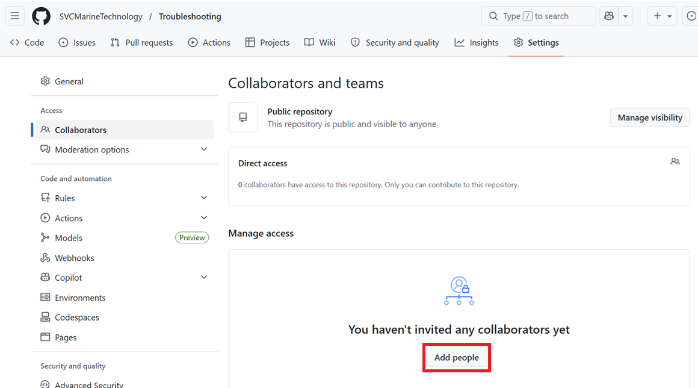
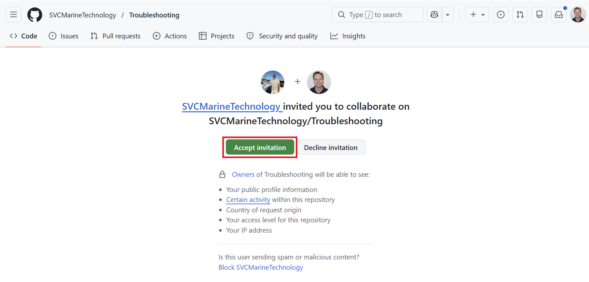
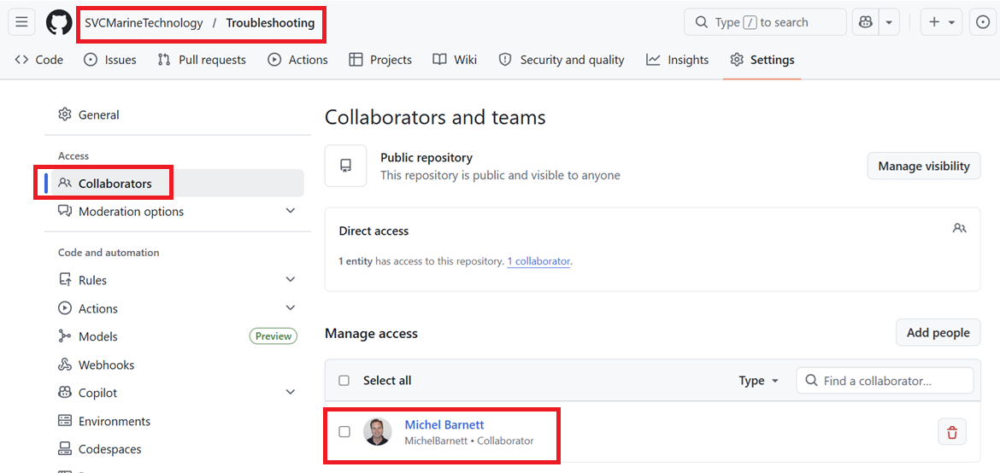

# Add Collaborators

In the previous procedures we created the following repo:

 https://github.com/SVCMarineTechnology/Troubleshooting

Now we want to add individual users who can contribute changes to the repo. These users are what GitHub calls *collaborators*.

Complete the following procedure to add a new collaborator.  You can use this as an example to add additional collaborators later.

## Invite Person to be a Collaborator

Adding a collaborator takes a couple of procedures.  The first one is to invite someone to be a collaborator in the repo.  Complete the following steps to do so:

1. Open a browser to the [Troubleshooting](https://github.com/SVCMarineTechnology/Troubleshooting) repo and *login as **SVCMarineTechnology***

2. Select **Settings >  Collaborators**

3. Click **Add People**.  For example:

   

4. Search for a user you want to add and click **Add**. For example:

   

## Accept Invitation

Before the collaborator is added to the repo, the invitation must be accepted by the recipient. The invited person should complete the following procedure.

1. In the email sent to the invited person, click **View invitation**

   

2. Click **Accept Invitation**

   

Once complete the user now shows up as a collaborator in the repo:

## Next Steps

Now that a collaborator has been added we can start making additional configuration changes to the repo.  We'll continue with [creating the main branch](create-main-branch.md).
