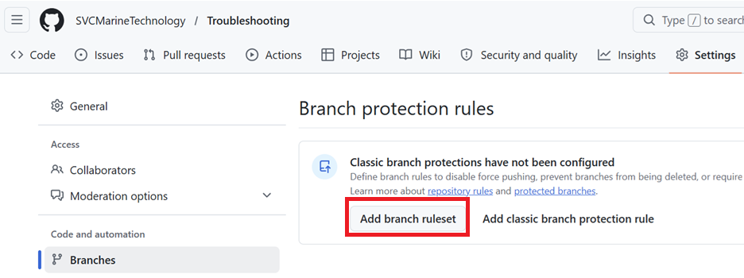

# Configure Branch Settings

By default there are no branch rules configured in the new repo. One that we want to create is to prevent merging to the main branch unless it's through a PR. Without it, we could simply merge changes to main like this:

```powershell
git add .
git commit -m "my update"
git push origin main
```

In the following procedure we'll create a branch rule to require that a PR be used to make any changes to main.

## Require a PR Before Merging to Main

1. Open a browser to the [Troubleshooting](https://github.com/SVCMarineTechnology/Troubleshooting) repo and *login as **SVCMarineTechnology***

2. Select **Settings > Branches** and click **Add branch ruleset** 

   

3. Enter parameters as follows:

   | Parameter          | Example Value                                                | Comments |
   | ------------------ | ------------------------------------------------------------ | -------- |
   | Ruleset name       | Require a PR before merging to main                          |          |
   | Enforcement status | Active                                                       |          |
   | Target branches    | 1. Click **Add Target**<br>2. Select **include by pattern**<br>3. Enter **main** and click **Add Including pattern** |          |
   | Branch rules       | Only check the following box:  **Require a pull request       before merging** |          |

4. Select additional parameters for **Require a pull request before merging** branch rule

   | Parameter              | Example Value                                                | Comments                                                     |
   | ---------------------- | ------------------------------------------------------------ | ------------------------------------------------------------ |
   | Required approvals     | 1                                                            | This is the setting now.  Initially this was set to `0` so that the first collaborator added to the repo could merge changes on his own. |
   | Additional  settings   | Require review from Code Owners<br>Require  conversation resolution before merging |                                                              |
   | Allowed merge  methods | Merge, Squash,  Rebase                                       |                                                              |

5. Click **Create**

## Next Steps

With the branch settings configured we can proceed with [creating a .gitignore](create-gitignore.md) file.

