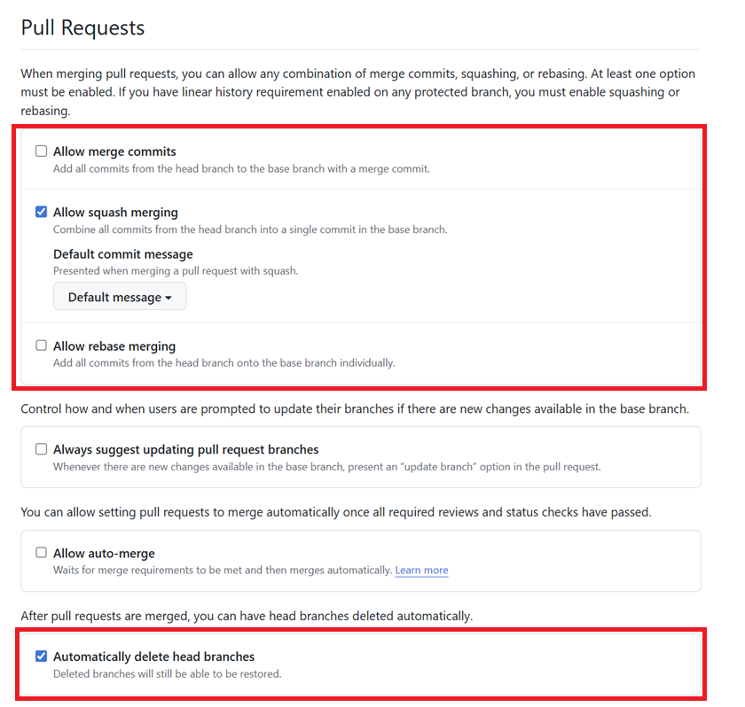

# Configure General Settings

There are a couple of Pull Requests settings we want to configure

- **Allow squash merging** - we'll allow this and turn off other merge options
- **Automatically delete head branches** - this automatically deletes our working branch after we merge the corresponding PR

Complete the following procedure to make these changes.

## Change Pull Request Settings

1. Open a browser to the [Troubleshooting](https://github.com/SVCMarineTechnology/Troubleshooting) repo and *login as **SVCMarineTechnology***

2. Select  **Settings > General**,  navigate to the **Pull Requests** section, and set the following options:

   

## Next Steps

Now that we've created `main` we can [configure branch settings](configure-branch-settings.md) for the new branch.