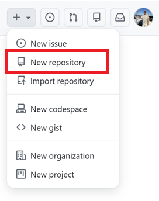
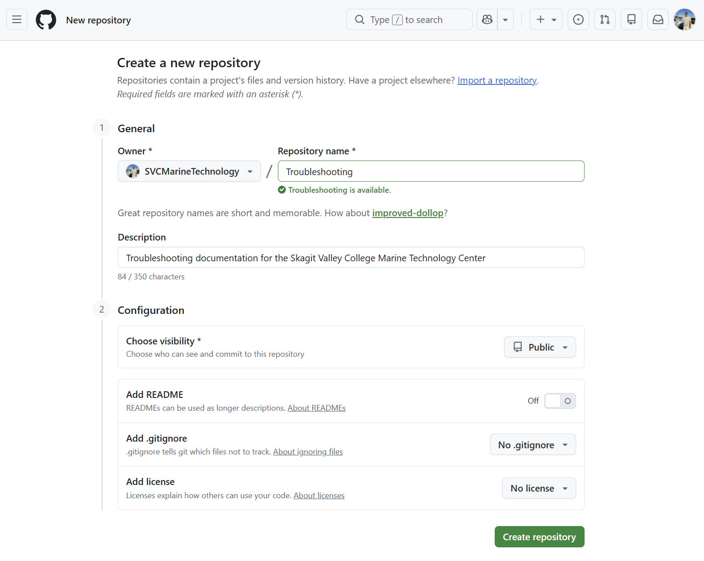

# Create GitHub Repo

The following procedure details how to create the GitHub repo we'll use to store our troubleshooting documentation.

## Create Repo

1. Open a browser to GitHub and *login as **SVCMarineTechnology***

   [GitHub](https://github.com/)

2. Select the **Create New > New repository** menu item (upper right)

   

3. Enter parameters as follows

   | Parameter         | Example Value                                                | Comments                                                     |
   | ----------------- | ------------------------------------------------------------ | ------------------------------------------------------------ |
   | Repository Name   | Troubleshooting                                              | If you're creating your own repo, modify this name as needed. Note that this  name will form the URL used to access the repo and rendered documentation. |
   | Description       | Troubleshooting  documentation for the Skagit Valley College Marine Technology Center | Enter a description                                          |
   | Choose visibility | Public                                                       | This means that  anyone on the Internet can see the repo (but you can still choose who can  commit to it.     Private is an option but it prevents us from configuring the repo the way we need (at least  for free GitHub repos). |
   | Add README        | Off                                                          | For this scenario  we don't need a readme                    |
   | Add .gitignore    | No .gitignore                                                | We'll add one later on                                       |
   | Add license       | No license                                                   | We won't need a license at this stage                        |

   for example:
   
   

4. Click **Create Repository**

## Next Steps

With the repository created you're ready to [Clone the Repo](clone-repo.md).