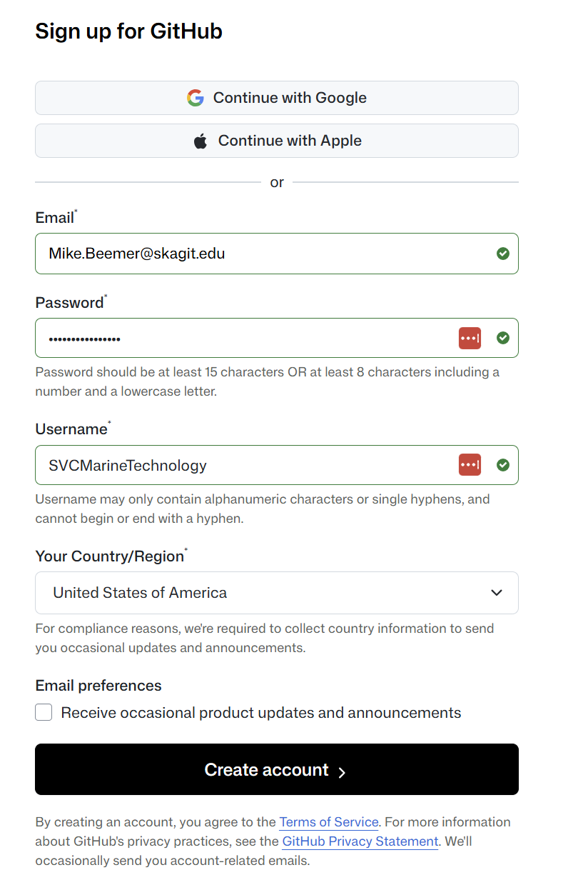
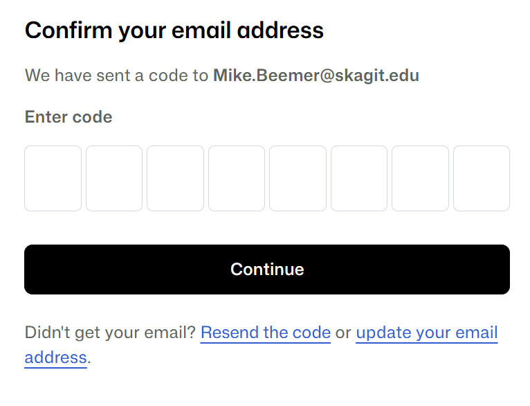

# Create GitHub User

If you don't already have a GitHub account you can create one using the following procedure.

> [!NOTE]
>
> In this procedure we're creating the **SVCMarineTechnology** github user. This choice of user name is important because the user name is part of the URL of the repo that we'll create later on:
>
> `http://github.com/<UserName>/<RepoName>`
>
> The user name is also part of the URL for our hosted markdown documentation:
>
> `https://<UserName>.github.com/<RepoName>`
>
> So, we're choosing a name that identifies the Marine Technology Center within Skagit Valley College.

> [!IMPORTANT]
>
> The purpose of the **SVCMarineTechnology** user is mainly to form the basis of the URLs above.  The only reason to login as this user is to change the configuration of the repo.  If you want to contribute changes to the content of the repo, login as a user account for yourself, after you've [made yourself a collaborator](add-collaborators.md).

## Sign up for GitHub

1. Open a browser to https://github.com

2. Click **Sign-up**

3. Enter parameters as follows

   | Parameter                                             | Example Value              | Comments                                                     |
   | ----------------------------------------------------- | -------------------------- | ------------------------------------------------------------ |
   | Email                                                 | Mike.Beemer@skagit.edu     | Enter the email address you want to associate with the account |
   | Password                                              | (enter a strong  password) | Enter whatever  password you like                            |
   | Username                                              | SVCMarineTechnology        | If you're signing up for yourself, enter a username  that identifies you. For example,  JohnSmith |
   | Your Country/Region                                   | United States of  America  |                                                              |
   | Receive occasional  product updates and announcements | (unchecked)                |                                                              |

   for example:

   

4. Create **Create Account**

   You should be prompted for a confirmation code:

   

5. Enter the confirmation code emailed to you and click **Continue**

## Next Steps

Once complete, your user account is created.  Now you're ready to [Create the GitHub Repo](create-github-repo.md).