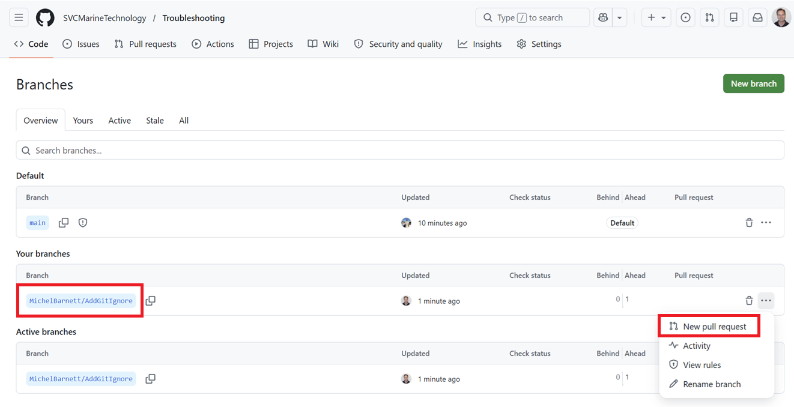
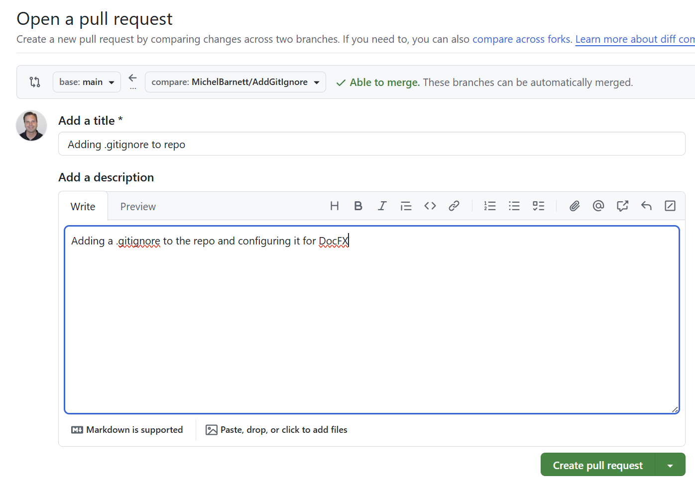
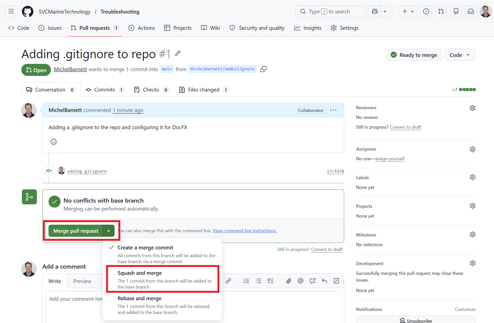
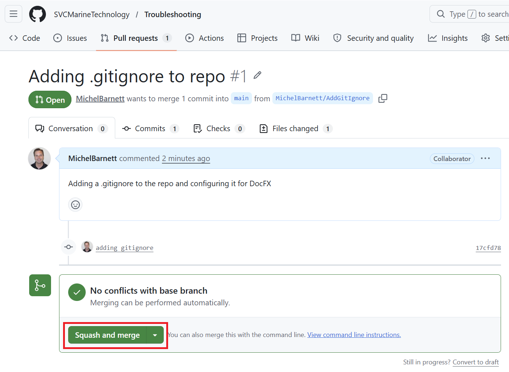
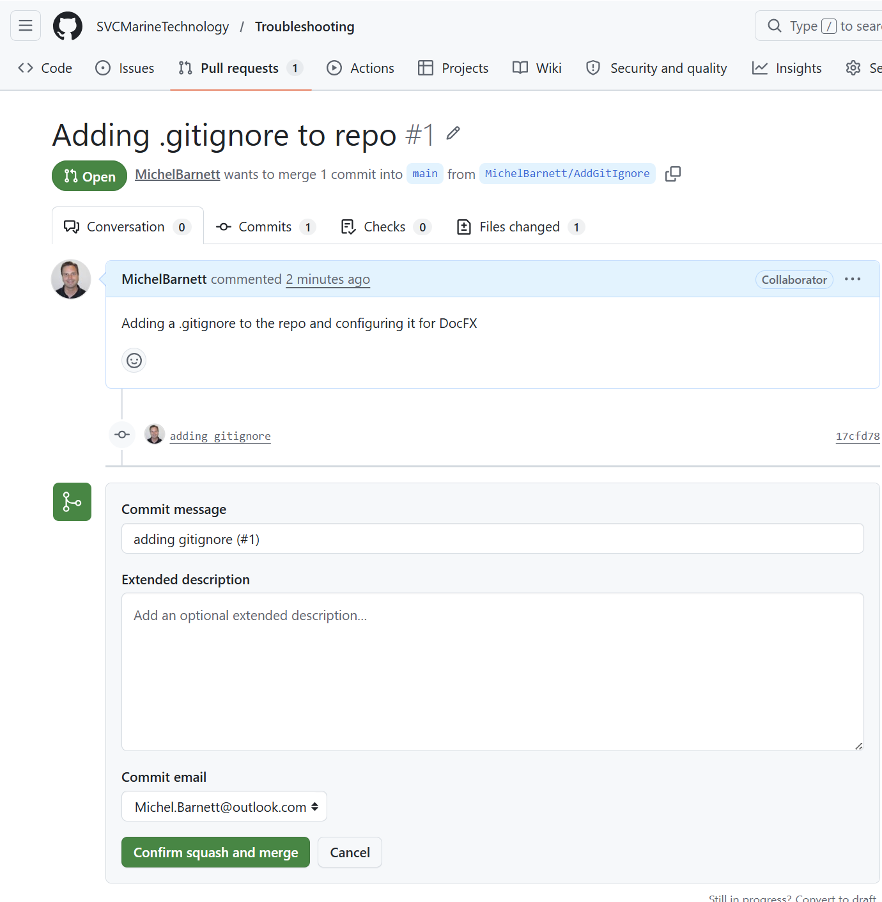
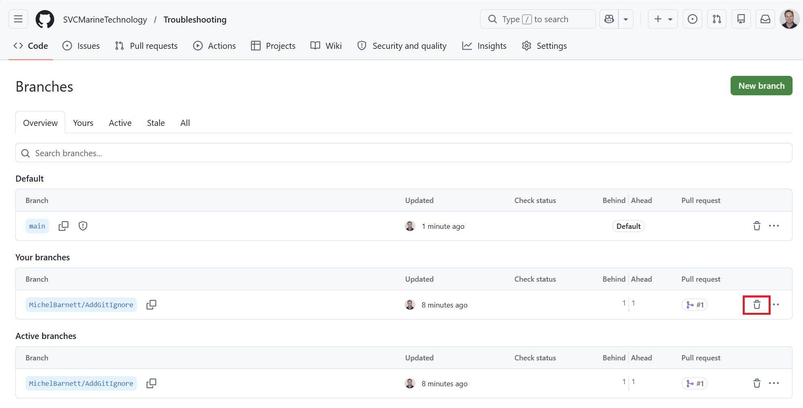
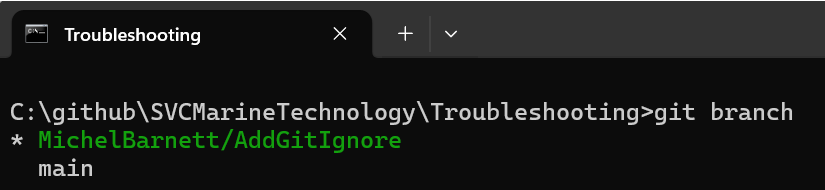
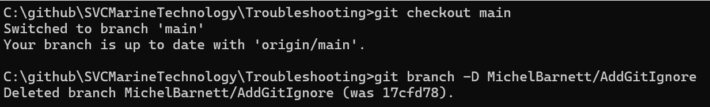
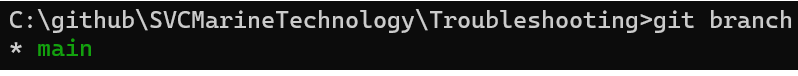

# Create GitIgnore

Before we start creating markdown files we'll want to create a [.gitignore](https://github.com/github/gitignore) file that ensure that Git ignores temporary files that we don't want to push to our repo. The following procedures walk you through adding a .gitignore file to our repo by creating and merging a pull request (PR).

> [!NOTE]
>
> This modification gives us a chance to add a needed file to our repo but also test the PR lifecycle that we'll use to contribute future changes.

## Create a Branch

1. Open a [Troubleshooting](https://github.com/SVCMarineTechnology/Troubleshooting) command prompt

   > [!IMPORTANT]
   >
   > Unless otherwise specified you should contribute changes to the repo as yourself (not **SVCMarineTechnology**).

2. Create a branch

   ```
   git checkout -b MichelBarnett/AddGitIgnore
   ```

## Create GitIgnore Fiole

1. Create a file at the repo root named .gitignore with the following content:

   > [!NOTE]
   >
   > This is a default `.gitignore` file appropriate for DocFX.

   ```
   # --- DocFX build output ---
   _site/
   api/
   obj/
   _temp/
   .cache/
   manifest.json
   ```

## Push Changes

1. In the same command prompt create a commit from the changes you made:

   ```powershell
   git add .
   git commit -m "adding gitignore"
   ```

2. Now push the changes:

   ```powershell
   git push --set-upstream origin MichelBarnett/AddGitIgnore
   ```

   > [!TIP]
   >
   > You only need to execute this full command the first time you push changes to the branch. On subsequent pushes you can simply run `git push`.
   >
   > A simple way to get a reminder of what this command line is to run `git push`, and you'll see a message like this:
   >
   > ```
   > C:\github\SVCMarineTechnology\Troubleshooting>git push
   > fatal: The current branch MichelBarnett/AddGitIgnore has no upstream branch.
   > To push the current branch and set the remote as upstream, use
   > 
   > git push --set-upstream origin MichelBarnett/AddGitIgnore
   > ```
   >
   > You can just copy and paste the full command rather than trying to create it from scratch.

## Open a Pull Request

1. Open a browser to the [Troubleshooting](https://github.com/SVCMarineTechnology/Troubleshooting) repo

2. Select **Branches**, and next to your branch name select the **Branch menu > New Pull Request** menu item

   

3. Add a title and description as follows and click **Create pull request**

   

## Merge

1. On the **Pull Requests** tab click **Merge pull request** for your PR

   

2. Click **Squash and Merge**

   

3. Click **Confirm squash and merge**

   

## Clean Up

### Delete your Branch in the Repo

   1. Open a browser to the [Troubleshooting](https://github.com/SVCMarineTechnology/Troubleshooting) repo

   2. Select branches and click **Delete** next to your branch

      

### Delete your branch locally

1. Open a [Troubleshooting](https://github.com/SVCMarineTechnology/Troubleshooting) command prompt

2. Execute

   ```powershell
   git branch
   ```

   You should see something like this:

   

3. Execute

   ```powershell
   git checkout main
   git branch -D MichelBarnett/AddGitIgnore
   ```

   You'll see something like this:

   

4. Execute

   ```
   git branch
   ```

   You should see that only the main branch remains:

   

## Next Steps

With the gitignore file checked in, we'll proceed with some additional repo configuration.  Specifically [configuring GitHub Pages](configure-github-pages.md).
