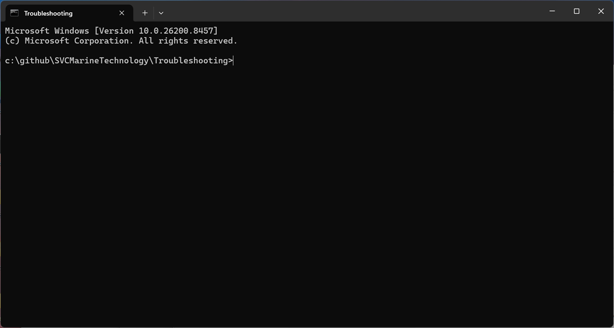

# Clone Repo

Before you can start working with the [Troubleshooting](https://github.com/SVCMarineTechnology/Troubleshooting) repo, you'll need to clone it on your workstation. Complete the following procedures to do so.

## Clone Repo

1. Open a new Command Prompt

2. Change to the directory where you'll clone the repository (create it if doesn't exist).  For example:

   ```powershell
   cd \github\SVCMarineTechnology
   ```

   > [!NOTE]
   >
   > You can clone the repo wherever you like.  The convention used in this guide is to place all github files in a directory structure following this convention:
   >
   > ```powershell
   > \github\<UserName>\<RepoName>
   > ```

3. Clone the repo by entering this command in the same command prompt:

   ```powershell
   git clone https://github.com/SVCMarineTechnology/Troubleshooting Troubleshooting
   ```

   This clones the repo to the `\github\SVCMarineTechnology\Troubleshooting` folder.

## [Optional] Create a Shortcut for The Repo

The rest of this guide includes steps that state:

1.  Open a [Troubleshooting](https://github.com/SVCMarineTechnology/Troubleshooting) command prompt

This is asking you to open a Windows Command Prompt where the current directory is the root of the repo we just cloned. The following procedure explains how to create a shortcut that accomplishes this.

1. Open the start menu, search for **Command Prompt**, right-click it, and select **Open File Location**

2. Drag the Command Prompt shortcut to the desktop

3. Rename the shortcut you just created to `Troubleshooting`

4. Right click the shortcut and select **Properties**. Set the properties as follows and click **OK**

   | Parameter | Example Value                                 | Comments |
   | --------- | --------------------------------------------- | -------- |
   | Start in  | c:\github\SVCMarineTechnology\Troubleshooting |          |

Now when you double-click this shortcut it'll open a Command Prompt to the directory where the new repo has been cloned.  For example:

