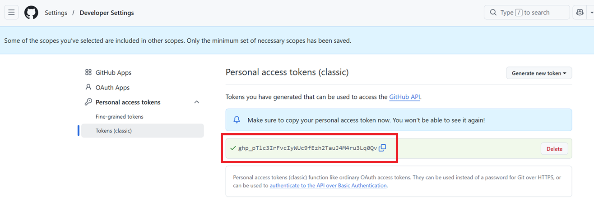

# Create Branch

In order to contribute changes to the repo, you'll need to create a branch to store your changes.  Complete the following procedures to do so.

## Create a Branch

1. Open a [Troubleshooting](https://github.com/SVCMarineTechnology/Troubleshooting) command prompt.

2. Pull the latest changes from main by executing

   ```powershell
   git checkout main
   git pull
   ```

   > [!TIP]
   >
   > Before creating a new branch from `main`, it's always a good idea to ensure you're on the `main` branch first, and that you have the latest changes by going a `git pull`.

3. Create a branch by executing the following:

   ```powershell
   git checkout -b <UserName>/<BranchName> 
   ```

   for example:

   ```powershell
   git checkout -b michelbarnett/contribute
   ```

   > [!NOTE]
   >
   > By convention prefix the branch with your user name and a forward slash and then choose a branch name that reflects the changes you're making.  In this example, we're creating a branch for changes to the repo contribution procedures.

## [macOS Only] Create a GitHub Personal Access Token

If you're on macOS, you'll need to create a GitHub Personal Access Token (PAT) in order to authenticate with GitHub.  If you don't, you'll be prompted for a username & password when you run the command in the next section.  However, this won't work because GitHub removed password authentication some time ago.

Complete the following procedures to create and use your PAT:

### Create a PAT

1. Open a browser to the [Troubleshooting](https://github.com/SVCMarineTechnology/Troubleshooting) repo

2. Click your profile picture (upper right) and select **Settings**

3. In the left sidebar, click **Developer settings**

4. Under **Personal access tokens**, click **Tokens (classic)**

5. click **Generate new token (classic) ** and authenticate if needed

6. Enter parameters as follows 

   | Parameter     | Example Value                           | Comments                                                     |
   | ------------- | --------------------------------------- | ------------------------------------------------------------ |
   | Note          | MacBookPro - Git Push - Troubleshooting | Enter whatever you like but it's best to use a name so that you know what it's for and where it's used.  The convention used here is: MACHINE-PURPOSE-SCOPE |
   | Expiration    | Custom: 05/28/2027                      | You can create a PAT with no expiration but it's a best practice not to.  The suggestion is to choose 'Custom' and enter a date one year from now. |
   | Select scopes | (select **repo**)                       | Selecting **repo** also selects all of the boxes under the **repo** label.  This gives you full access to the repo. |

7. Click **Generate token**.

8. Copy the PAT that's generated for you:

   

## Use your PAT

In the next section when you run `git push` you'll be prompted for credentials.  When you are, enter the following parameters:

| Parameter | Example Value                                      | Comments                          |
| --------- | -------------------------------------------------- | --------------------------------- |
| Username  | (enter your GitHub username)                       |                                   |
| Password  | (paste the PAT you copied in the previous section) | Do NOT enter your GitHub password |

Git will store the new token in Keychain.  You should not be prompted for credentials again (at least until your PAT expires). 

Use these notes to complete the instructions in the next section.

For additional information see:<br>[Managing your personal access tokens](https://docs.github.com/en/authentication/keeping-your-account-and-data-secure/managing-your-personal-access-tokens)

## Set the Upstream Branch

Before we can push changes we need to associate the local branch we just created with a corresponding branch in the GitHub repo.  Complete the following procedure to do so.

1. In the same command prompt execute:

   ```powershell
   git push
   ```

   The response will look something like this:

   ```powershell
   fatal: The current branch michelbarnett/contribute has no upstream branch.
   To push the current branch and set the remote as upstream, use
   
       git push --set-upstream origin michelbarnett/contribute
   ```

   > [!NOTE]
   >
   > The `--set-upstream` command is what we need to execute.  Running `git push` when we know it'll fail is an easy way to get git to generate the command for us.

2. Copy-and-paste the command that git just gave us:

   ```powershell
   git push --set-upstream origin <BranchName>
   ```

   for example:

   ```powershell
   git push --set-upstream origin michelbarnett/contribute
   ```

   This associates our local branch with a remote branch in the repo (that's named the same).  

   > [!IMPORTANT]
   >
   > If you're on macOS, make sure you've completed this procedure first: TBD.  If you don't, you'll get prompted for a username and password when you run this command.

From now on you can push changes simply by executing:

````powershell
git push
````

