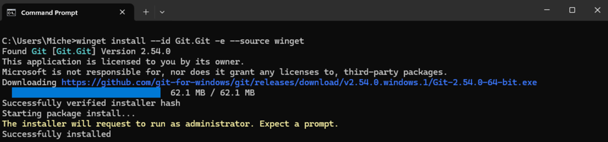
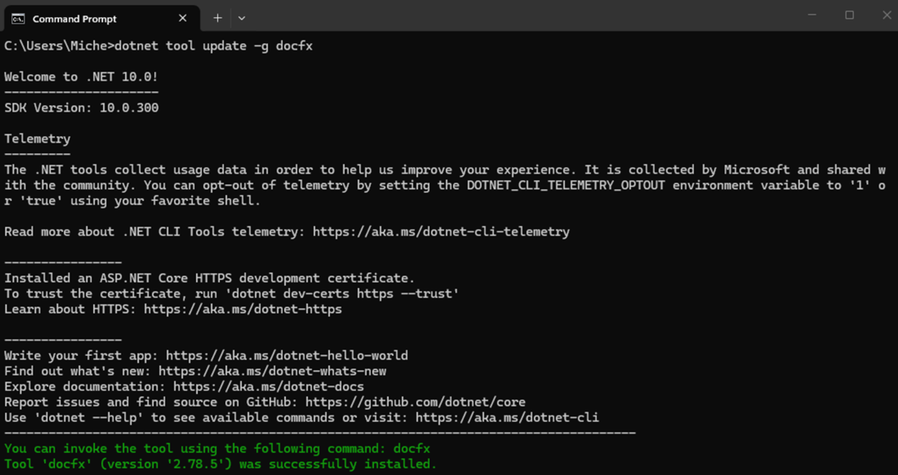

# Install Software on Windows

The following procedures we're run on a machine with the following software:

- Windows 11 Home (Version 25H2) - This includes installing all updates through Windows Update and updating all applications in the **Microsoft Store** app.

You can have additional software installed but it's suggested you start with at least this version of the operating system.

Complete the following procedures in order.  When this software is installed, you'll be ready to clone the repo and edit any files that you like.

## Install Git

1. Open a new **Command Prompt** and execute:

   ```powershell
   winget install --id Git.Git -e --source winget
   ```

   you should see something like this:

   

Now when you open a command prompt you can execute `git` by typing:

```powershell
git
```

For additional information see:<br>[Git - Install for Windows](https://git-scm.com/install/windows)

## Install DocFX

1. Install the latest version of the .NET SDK by opening this link and following the directions:

    [.NET SDK](https://dotnet.microsoft.com/en-us/download) 

2. Install DocFX by opening a new **Command Prompt** and executing:

   ```powershell
   dotnet tool update -g docfx
   ```

   you should see something like this:

   

3. Install the latest version of Node.js by opening this link and following the directions:

   [Node.js — Run JavaScript Everywhere](https://nodejs.org/en)

Now when you open a command prompt you can execute `docfx` by typing:

```powershell
docfx
```

For additional information see:<br>[DocFX Quick Start](https://dotnet.github.io/docfx/)

## [Optional] Install Visual Studio Code

1. Install the latest version of Visual Studio Code by opening this link and following the directions:

   [Download Visual Studio Code - Mac, Linux, Windows](https://code.visualstudio.com/download)

For additional information see:<br>[Visual Studio Code](https://code.visualstudio.com/)

## [OPTIONAL] Install Typora

1. Install the latest version of Typora by opening this link and then downloading and installing the tool for your platform:

   [Typora — simple yet powerful Markdown reader.](https://typora.io/)

   > [!TIP]
   >
   > The download link is near the bottom of the page.

2. Purchase a license using the same link above (the purchase button is right next to the download button).
3. Enter the license key that's emailed to you into Typora (you'll be prompted at initial startup)

For additional information see:<br>[Typora — simple yet powerful Markdown reader.](https://typora.io/)