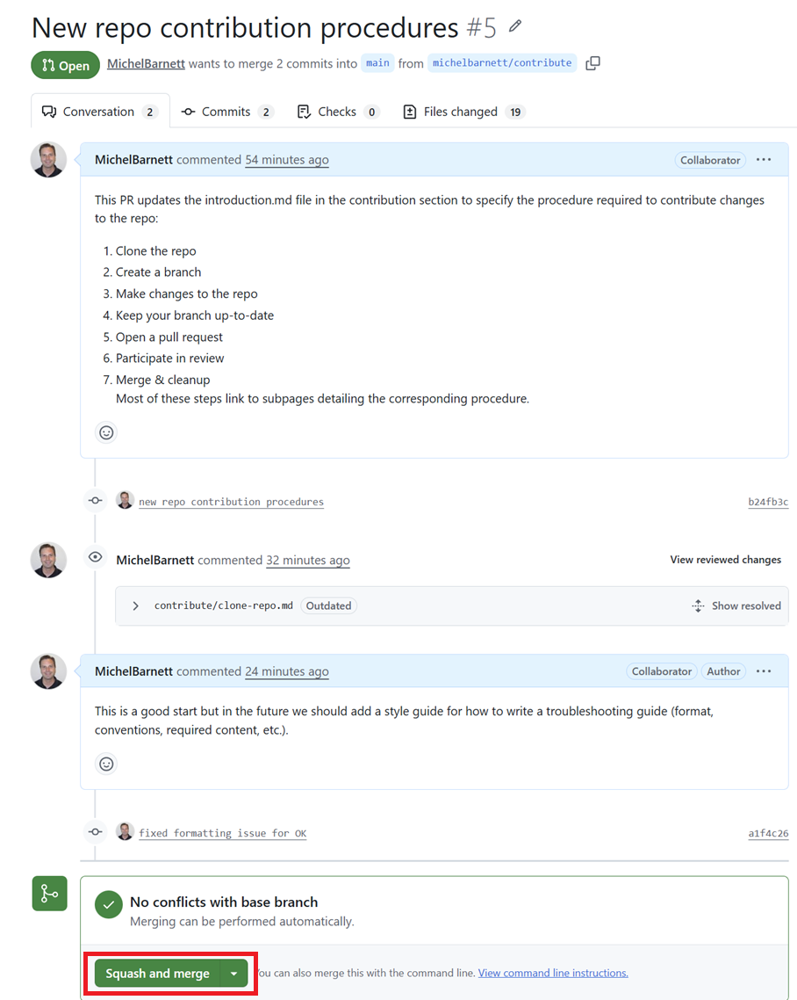
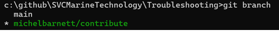

# Merge and Clean Up

When your PR is approved and you're ready to merge, complete the following steps to do so.

## Merge PR

1. Open the PR you want to merge.  For example:

   https://github.com/SVCMarineTechnology/Troubleshooting/pull/5

2. Click Squash and Merge

   

## Delete the Repo Branch

Now that the change has been merged we need to delete the branch we created.

1. Open a [Troubleshooting](https://github.com/SVCMarineTechnology/Troubleshooting) command prompt

2. View current branches by executing:

   ```powershell
   git branch
   ```

   for example:

   

3. Delete the branch by executing:

   ```powershell
   git branch -D <BranchName>
   ```

   for example:

   ```powershell
   git branch -D michelbarnett/contribute
   ```

   