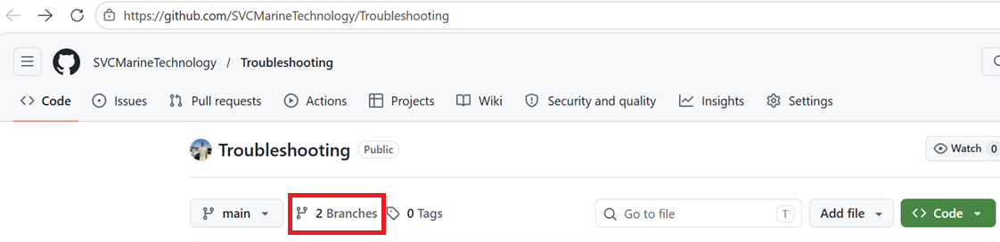
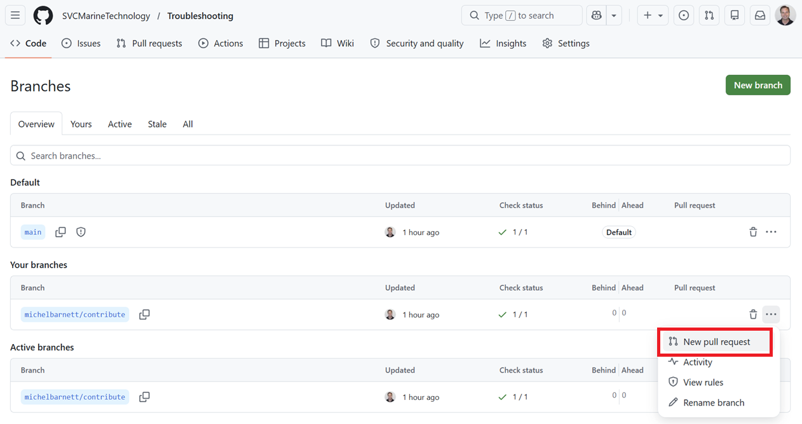

# Open Pull Request

When you're ready to put your changes up for review, you'll need to open a pull request.  Complete the following procedures to do so.

## Create Pull Request

1. Open a browser to the [Troubleshooting](https://github.com/SVCMarineTechnology/Troubleshooting) repo

2. Click branches

   

3. Click the branch menus next to your branch and select **New pull request**

   

4. Set the following parameters

   TBD