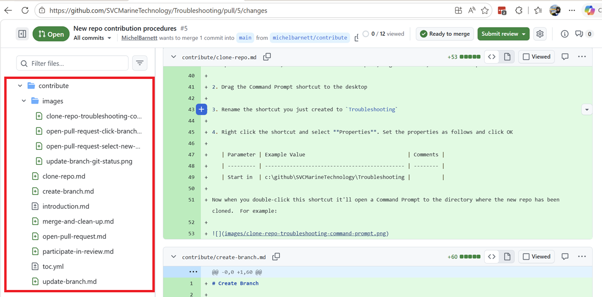
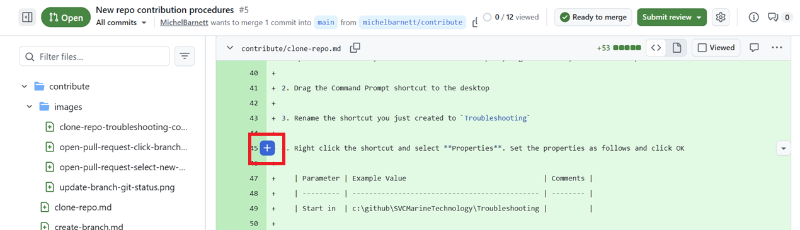
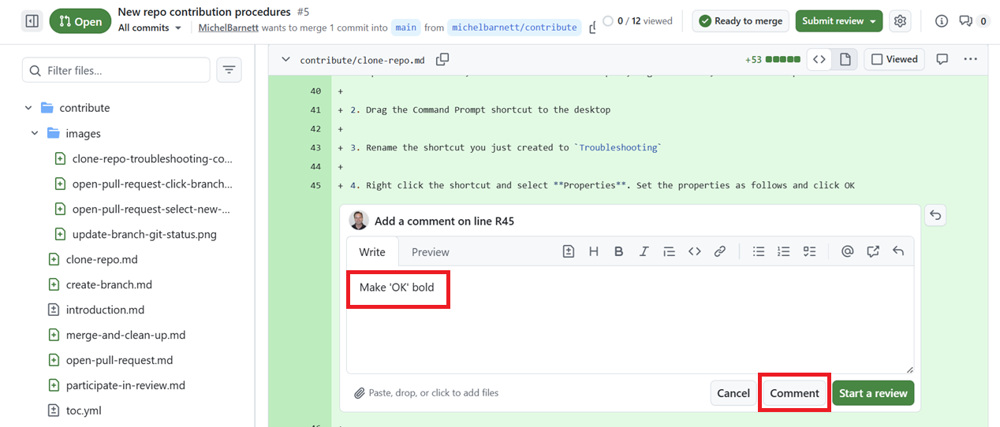
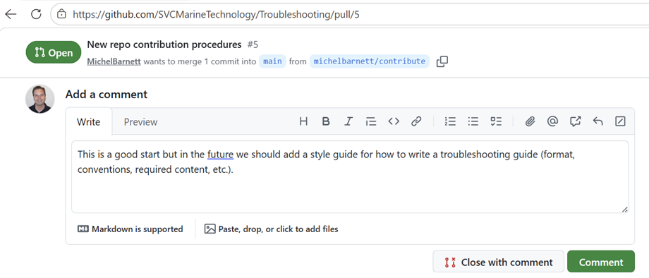
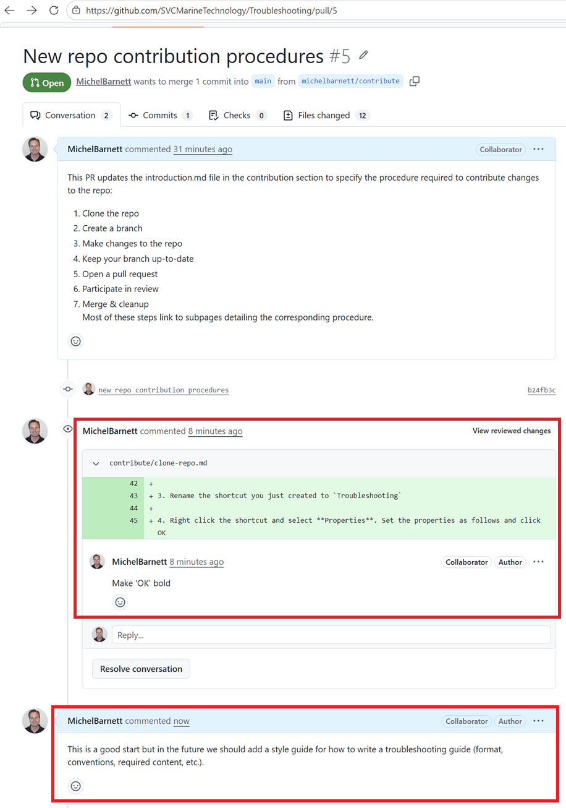
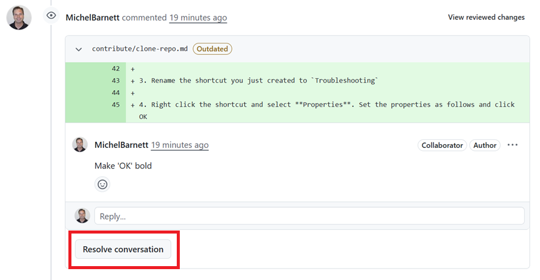
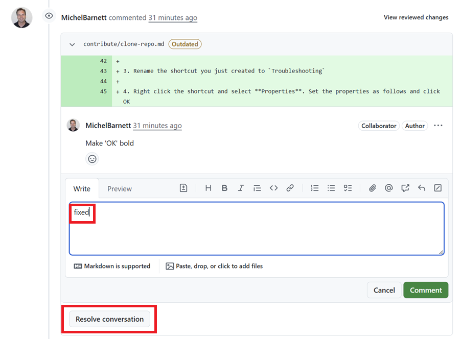

# Participate in Review

Once a pull request (PR) is created, it needs to be reviewed and approved before merging it into the `main` branch.  The following procedure walks you through the most common actions you'll complete when reviewing a PR.  In this example, we're using the following PR.

https://github.com/SVCMarineTechnology/Troubleshooting/pull/5

## Reviewing a Pull Request

1. Open the PR you want to review.  For example:

   https://github.com/SVCMarineTechnology/Troubleshooting/pull/5

2. Review the change.  You'll want to pay particular attention to the following items:

   - **Description** - Read it to understand the overall change
   - **Comments** - Check if others have added a comment to learn about issues that have already been identified.
   - **Files changed** - Review the individual files that have been modified in the PR

   for example:

   

## Add a comment to a file

Most of the comments you'll make will probably be to a specific file.  The following example demonstrates how to make a file specific comment:

1. Open the PR and select **Files changed**.  For example:

   

   The list of files on the left are all of the files that are changed in this PR.  In this example, all of the files are in the `contribute` directory.  This is a good way to a get a quick read on which parts of the repo have been modified.

2. Add a comment by selecting a a line and clicking the `+` button.  For example:

   

3. Enter a comment and click **Comment**.  for example:

   

## Add a General Comment

You can also add general comments to the PR.  This is appropriate when the comment isn't file specific but applies to the overall PR.   Complete the following steps to do so.

1. Open the PR, enter a comment in the Add a comment section at the end of the page and click **Comment**.  For example:

   

## Resolve a Comment

As the person who create the PR, you'll need to resolve all comments before you can merge your PR to main.  Here's an example of how to resolve a comment.

1. Open your PR and review the comments that have been made.  In this example there are two comments:

   

2. Make the changes suggested by the comment.  

   > [!NOTE]
   >
   > In this example, we're resolving the first comment by fixing the formatting issue and making 'OK' bold.  This means changing the appropriate file and pushing the change.

3. Resolve the comment by clicking **Resolve conversation**.

   > [!TIP]
   >
   > If you're not ready to resolve the conversation you can also reply to the reviewer by entering a message in the **Reply** text box.

   

   4. Now enter a message to the reviewer and click **Comment**.

   

> [!TIP]
>
> It's helpful to write something so the reviewer knows you actually did something before resolving the comment.  Simply writing 'fixed' is a good example.  Add additional detail if appropriate.

This resolves this particular comment.  Resolving any other comment (including general comments) works the same way.

   