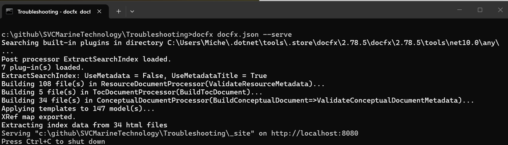
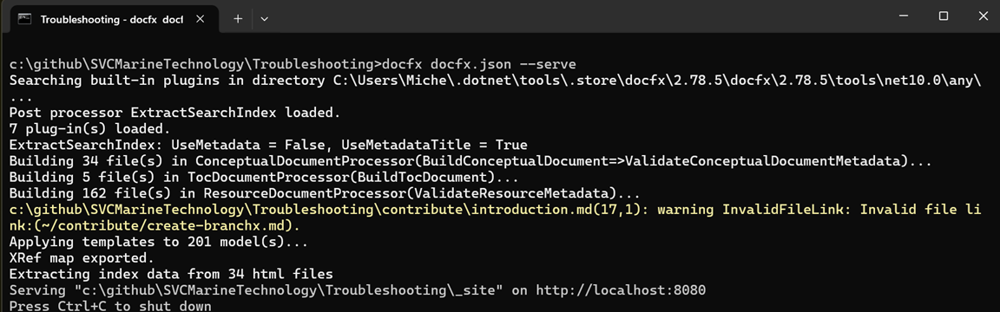
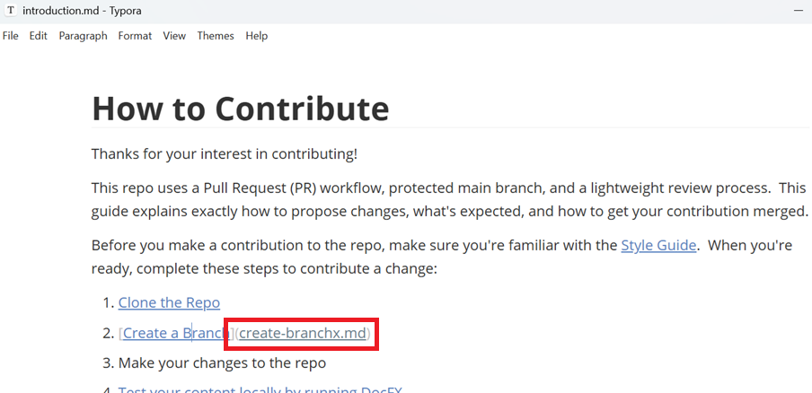
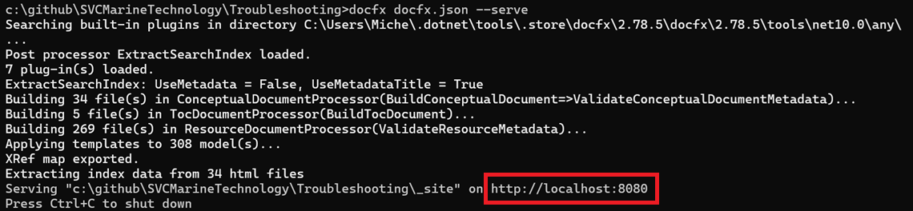
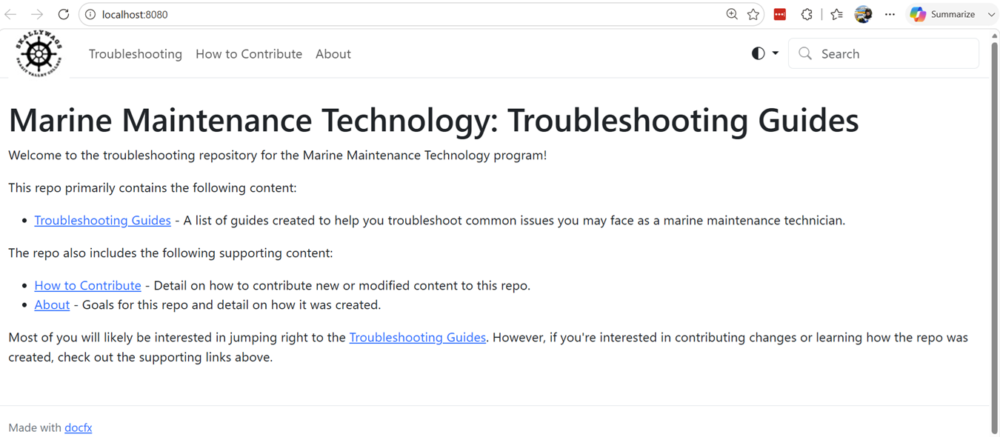

# Test your content locally by running DocFX

We're using DocFX to turn our markdown files into HTML.  When we merge new markdown files into the `main` branch, our GitHub repo automatically compiles the updated markdown files into HTML and then hosts that content here:

[Marine Maintenance Technology: Troubleshooting Guides](https://svcmarinetechnology.github.io/Troubleshooting/)

This means it's important that, before we complete a PR, we've checked our content by running DocFX locally to ensure there are no compilation errors and our content renders as expected.  Complete the following procedures to perform this check.

> [!TIP]
>
> You should definitely verify your content using DocFX before you put a PR up for review.  But it's also a good idea to periodically do this as you write your content so you find errors as early as possible.

## Build Markdown Files

We're going to start by using DocFX to build our Markdown files into the HTML that is rendered on our GitHub pages site.  Complete the following steps to do so.

1. Open a [Troubleshooting](https://github.com/SVCMarineTechnology/Troubleshooting) command prompt.

2. Execute

   ```powershell
   docfx docfx.json --serve
   ```

   you should see something like this:

   

## Fix DocFX Compilation Errors

A successful DocFX execution looks like the screenshot in the previous section.  If that's what you see then you don't have any errors and you can proceed to the next section.

When errors do occur, they're often due to broken references.  For example:



The yellow warning is telling you there's an error in `contribute\introduction.md`.  Specifically there's an invalid file link.  Specifically the reference to `contribute/create-branchx.md` is invalid.  If we open `introduction.md` and click on that link it's easy to see the error:

 

in this case we have a typo.  The markdown file reference should be corrected to `create-branch.md`.  Doing so eliminates the error.

This is just one example, but it's pretty typical of the warnings that might be generated.  Be sure you can run DocFX *cleanly* (no warnings) before putting up your PR.

## Verify DocFX Output

Even if there are no DocFX warnings, it's possible that the generated HTML doesn't render properly.  Something as simple as a space in the wrong place can cause formatting issues.  Before you consider your content done, open the troubleshooting guide and visually check the pages you modified to ensure they look as expected.  You can do that by completing these steps:

1. Open a browser to the URL that `docfx docfx.json --serve` writes to the console: http://localhost:8080

   You can find this URL in the output of the DocFX command we just ran:

   

   you should see something like this:

   

   This is a locally rendered version of the content that we publish in our GitHub Pages site: [Marine Maintenance Technology: Troubleshooting Guides](https://svcmarinetechnology.github.io/Troubleshooting/).  We can use this to verify our content is rendering correctly before we merge changes into the `main` branch.

1. Click through the locally rendered site to verify that any changes you made have been rendered correctly.

When you can build your Markdown files without warning and you verify they're rendered properly, then you're ready to push changes and create a pull request.

