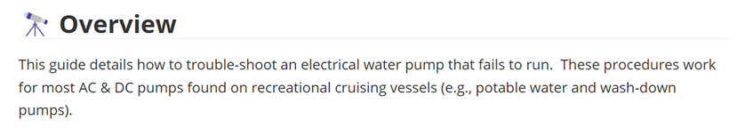
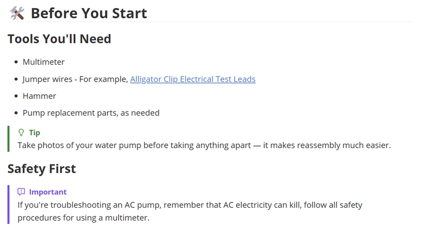
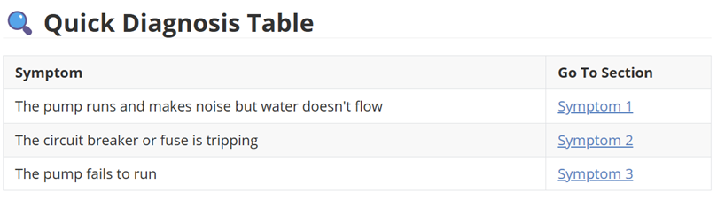
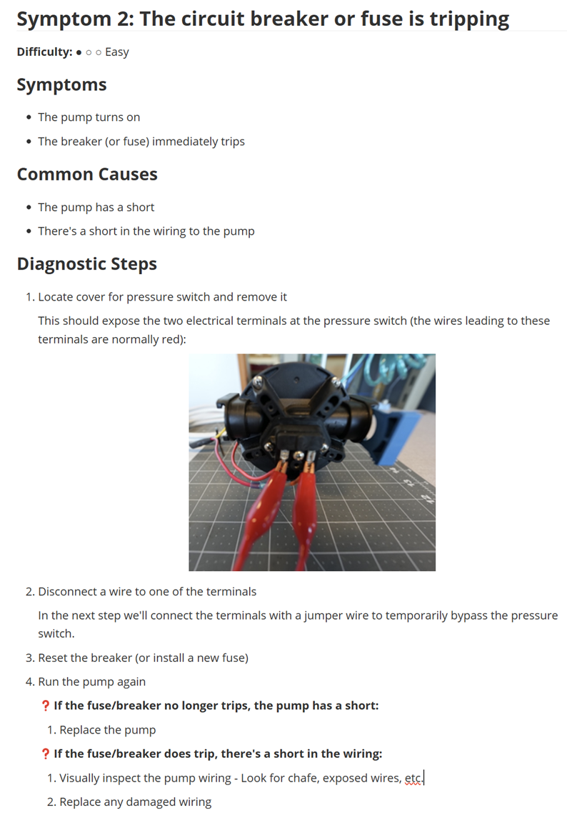
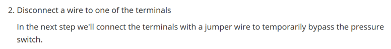
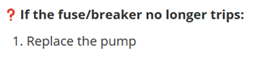
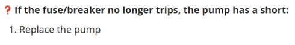

# Style Guide

The troubleshooting guides in this repo have a specific format and follow particular conventions designed to to maximize readability and ensure consistency.  The following content explains these conventions by walking through key parts of the [template](template.md) that each troubleshooting guide is based on.  

The following provides a walkthrough of some general conventions followed by a walkthrough of each section in the template.

Be sure you're familiar with this content before modifying or creating a troubleshooting guide.

## Reference and Conventions

### Markdown Tools

- Use whatever markdown editor you like - However, note that the core content of this repo was written in [Typora](https://typora.io/)

### Markdown

- If you're unfamiliar with Markdown, this is a good quick reference: [Markdown Basic Syntax](https://www.markdownguide.org/basic-syntax/)

### DocFX

- The main site for DocFX can be found here: https://dotnet.github.io/docfx
- The DocFX configuration for this repo probably won't need to be changed.  But if you're looking for an explanation of the root level docfx.json file, here's the right reference: [DocFX Config Reference](https://dotnet.github.io/docfx/reference/docfx-json-reference.html).

### File Naming

- Markdown files - 
  - name markdown files using lower case characters separated by a dash (`-`) in place of a space.
  - make markdown file names descriptive of the content.
- Image files
  - all images should be placed in the `images` folder contained in the same directory as the referencing markdown file.
  - name image files using the same convention as markdown files (lower case characters and dashes)
  - the name of of image file should be prefixed by the name of the referencing markdown files.  For example, if a markdown file is named `introduction.md` then an image referenced from that file should have a name that starts with `introduction-` (e.g., `introduction-inverter-schematic.png`).  This makes it easy to associate image files with their referencing markdown file.
  - don't share images between markdown files.  If you need the exact same image in two different markdown files, copy the image.
  - make image file names descriptive of the content.

## Title

This is the title of the guide.

Example:

Key points:

- The Title is prefixed by the 🔧symbol.
- Use the format `<Subject> Troubleshooting`

## Overview

This is a summary of the purpose and objectives of the guide.  Generally this consists of a single paragraph, but include additional detail if needed.

Example:

Key points:

- The **Overview** header is prefixed with the 🔭 symbol

## Before You Start

This section contains two sub-sections:

- Tools You'll Need - a list of tools you'll need to complete the steps in the guide
- Safety First - Any safety considerations that are relevant to the steps you're asking the reader to perform

Example:

Key points:

- The **Before you Start** header is prefixed with the 🛠️ symbol
- Keep the list of tools brief.  Provide links to examples if the tool isn't obvious.
- The Safety First section is optional.  If there are no particular safety considerations then delete this section.

## Quick Diagnosis Table

This section consists of a table listing each symptom along with a link to a section detailing that symptom.

Example:

Key points:

- The **Quick Diagnostic Table** header is prefixed with the 🔍 symbol
- The main purpose of this table is to give the reader an easy to to match the symptom they're seeing with a symptom in this site.  Make the symptom descriptions clear and concise.
- The entries in the Go To Section column are always in the format `Symptom <Number>` where `<Number>` starts at 1 and counts up.  The link is to the corresponding Symptom section.

## Symptom

This section contains the following parts:

- Difficulty
- Symptoms
- Common Causes
- Diagnostic Steps

Example:

Key points:

- For **difficulty**, specify one of the following options:

  | Difficulty Level | Description                                                  |
  | ---------------- | ------------------------------------------------------------ |
  | ● ○ ○ Easy       | The steps can be performed by anyone with fundamental electrical awareness.   - No exposure to energized AC circuits - Minimal tools (multimeter, screwdriver) - Low risk of damaging equipment - Steps are straightforward and mostly observational - Examples: checking fuses, verifying breaker positions, inspecting connections for corrosion |
  | ● ● ○ Moderate   | Tasks requiring working knowledge of DC/AC systems, safe meter use, and the ability to follow multi-step diagnostic logic   - May involve opening panels or accessing wiring spaces - Requires interpreting voltage readings or continuity tests - Moderate risk if steps are skipped or done incorrectly - Examples: diagnosing voltage drop, testing charging output, verifying ground continuity |
  | ● ● ● Hard       | Tasks requiring advanced marine electrical expertise, ABYC‑level understanding, or work on circuits where mistakes can cause equipment damage, fire risk, or safety hazards. - Involves AC shore power, inverter/charger systems, or high‑current DC circuits - Requires advanced tools and interpretation of complex symptoms - Requires significant system disassembly or rewiring - Examples: diagnosing inverter faults, isolating AC neutral/ground issues, troubleshooting charging systems under loa |

- Make symptoms and common causes brief and concise

- The Diagnostic Steps section includes some important conventions:

  - Numbered items - lines that are numbered are *exclusively* actions that the reader is expected to perform. This allows the reader to quickly scan the procedure and pick out the things they're supposed to do versus.

  - If you need to add additional exposition to a numbered step then add it on a line just under the step.  For example:

    

  - Conditions are prefixed by a ❓ symbol, are written in **bold**, and followed by a colon.  Conditions are either written in isolation.  For example:

    

    if needed, conditions can be followed by a short description of the meaning of the description.  For example:

    

    In this case we've added the phrase *the pump has a short*, indicating that the meaning of the fuse/breaker no longer tripping.

  - Indent conditions under the numbered step that they're supporting

  - Indent any numbered steps under a condition that the reader should perform if the condition is true