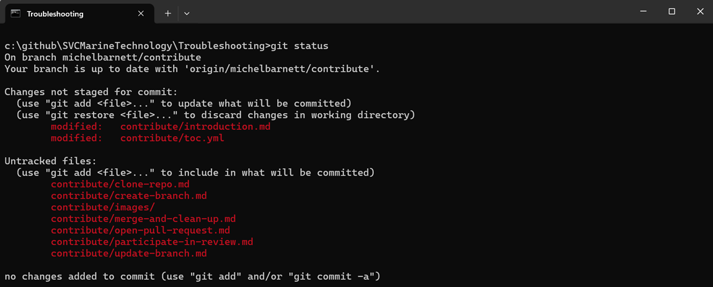

# Keep Branch Up-To-Date

It's a good idea to push your local changes to the repo on a regular basis.  Complete the following procedure to do so.

## [Optional] View Pending Changes

It's usually helpful before you push changes to see what they are first.  Complete the following steps to see the changes you haven't pushed yet.

1.  Open a [Troubleshooting](https://github.com/SVCMarineTechnology/Troubleshooting) command prompt.

2. Execute the following:

   ```powershell
   git status
   ```

   Here's an example of what you'll see:

   

## Push Changes

1. Stage your changes by using the `git add` command. For example:

   ```powershell
   git add .
   ```

   > [!NOTE]
   >
   > We're specifying `.` as an argument to `git add` which means: *stage all new, modified, deleted files in the current directory and all sub-directories*.  There are many variations on on the argument to this command.  See documentation on the [git add](https://github.com/git-guides/git-add) command for more detail.

2. Create a commit

   ```powershell
   git commit -m "<YourComment>"
   ```

   for example:

   ```powershell
   git commit -m "new repo contribution procedures"
   ```

   > [!TIP]
   >
   > Make your comment descriptive so it's easier to identify the associated changes.

3. Push your changes by executing:

   ```powershell
   git push
   ```

Now your local changes are synced with the github repo.