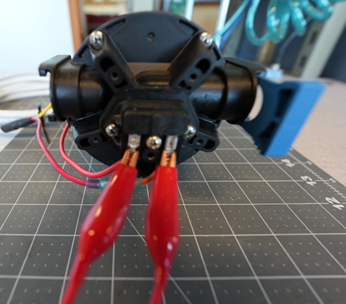

# 🔧 Water Pump Troubleshooting
---
## 🔭 Overview

This guide details how to trouble-shoot an electrical water pump that fails to run.  These procedures work for most AC & DC pumps found on recreational cruising vessels (e.g., potable water and wash-down pumps).  

## 🛠️ Before You Start

### Tools You'll Need

- Multimeter
- Jumper wires - For example, [Alligator Clip Electrical Test Leads](https://www.amazon.com/Dual-Ended-Alligator-Electrical-Protective-Insulators/dp/B0DP1YQS8C/ref=sr_1_6_sspa?crid=2LHC7QOX2Z66J&dib=eyJ2IjoiMSJ9.KBxo6lO7_Ma1a_a4Ra0WjHT2-B-qqawbsVKvoQNDTgEqBV4L2Cr1LlBq7hJGIoNJsTHk8bioilrg4edPQlgX52tNjpNcijDreUHKNt_T4jubym6x8GTPf0tP4XCGdeAjQlKnNtHdFbxnu0ewUuim6D5kYpxScT24atEdNlKpfE9hFMGQSP9a315oiDFedLVomErQ2yXGPS6lK3NniHKllM5EVm99sNPMCaAEbabsiD0._YYWu5FrsCG-CmIr7KinSF27ZePmf14FxX2_y5MEM5A&dib_tag=se&keywords=jumper%2Bwire&qid=1779210019&sprefix=jumper%2Bwire%2Caps%2C236&sr=8-6-spons&sp_csd=d2lkZ2V0TmFtZT1zcF9tdGY&th=1)
- Hammer
- Pump replacement parts, as needed

> [!TIP]
> Take photos of your water pump before taking anything apart — it makes reassembly much easier.

### Safety First

> [!IMPORTANT]
> If you're troubleshooting an AC pump, remember that AC electricity can kill, follow all safety procedures for using a multimeter.

---

## 🔍 Quick Diagnosis Table

| Symptom | Go To Section |
|---|---|
| The pump runs and makes noise but water doesn't flow | [Symptom 1](#symptom-1-the-pump-runs-and-makes-noise-but-water-doesnt-flow) |
| The circuit breaker or fuse is tripping | [Symptom 2](#symptom-2-the-circuit-breaker-or-fuse-is-tripping) |
| The pump fails to run | [Symptom 3](#symptom-3-the-pump-fails-to-run) |

---

## Symptom 1: The pump runs and makes noise but water doesn't flow

**Difficulty:** ● ○ ○ Easy

### Symptoms

- When the pump is on it makes noise
- Water doesn't flow

### Common Causes

- The tank is out of water
- The pump head/check valves are worn out

### Diagnostic Steps

1. Visually inspect the tank and ensure you have water

   ❓**If there's little or no water:**

   1. Add water to the tank

   2. Retest the pump 

   > [!TIP]
   >
   > Do not trust the tank gauge.  Physically check the tank for water.

2. Check valves to ensure water can flow to the pump

   Ensure that any valves between the tank and the pump are open

   ❓**If valves are closed:**

   1. Open any closed valves between the tank and the pump

❓**If water still isn't flowing:**

1. Replace the pump head (if that option is available)

   or

2. Replace the  pump

---

## Symptom 2: The circuit breaker or fuse is tripping

**Difficulty:** ● ○ ○ Easy

### Symptoms

- The pump turns on
- The breaker (or fuse) immediately trips

### Common Causes

- The pump has a short
- There's a short in the wiring to the pump

### Diagnostic Steps

1. Locate cover for pressure switch and remove it

   This should expose the two electrical terminals at the pressure switch (the wires leading to these terminals are normally red):

   

2. Remove one of the two wires 

   This takes the pump out of the circuit

3. Reset the breaker (or install a new fuse)

4. Turn on the pump again

   ❓**If the fuse/breaker no longer trips, the pump has a short:**

   1. Replace the pump

   ❓**If the fuse/breaker does trip, there's a short in the wiring:**

   1. Visually inspect the pump wiring - Look for chafe, exposed wires, etc.
   2. Replace any damaged wiring

---

## Symptom 3: The pump fails to run

**Difficulty:** ● ● ○ Moderate

### Symptoms

- There's no reaction from the pump when turned on (i.e., no noise or vibration)

### Common Causes

- No power to the pump
- Bad pressure switch
- Bad pump motor

### Diagnostic Steps

1. Ensure battery switch and/or circuit breaker is on

   ❓**If a switch is off:**

   1. Turn on the switch (or circuit breaker)

2. Locate cover for pressure switch and remove it

   This should expose the two electrical terminals at the pressure switch (the wires leading to these terminals are normally red):

3. Connect a jumper wire across the two terminals

   > [!TIP]
   >
   > If you don't have a jumper wire, you can remove one of the wires and touch it to the other.

   

   ❓**If the pump runs, the pressure switch is bad:**

   1. Replace the pressure switch (if that option is available)

      or

   2. Replace the pump

   ❓**If the pump does not run ensure voltage is being supplied to the pump:**

    1. Set your multimeter to DC volts

    2. Connect the multimeter's positive lead to the red source wire; connect the ground lead to a known ground.

       ❓**If the multimeter reads 12 volts (or system voltage) and the pump does not run with the jumper wire, the pump is likely bad:**

       1. Tap the pump with a hammer to see if a brush is hung up

          ❓**If the pump still doesn't run:**

          1. Replace the pump

       ❓**If the multimeter reads no voltage**:

       1. Use jumper wires to connect 12 volts to the pump directly

          ❓**If the pump still doesn't run, the pump is bad:**

          1. Replace the pump

          ❓**If the pump does run, you most likely have blown over current protection (OCP), a bad conductor, or switch failure:**

          1. Work through the system to find the fault

       
